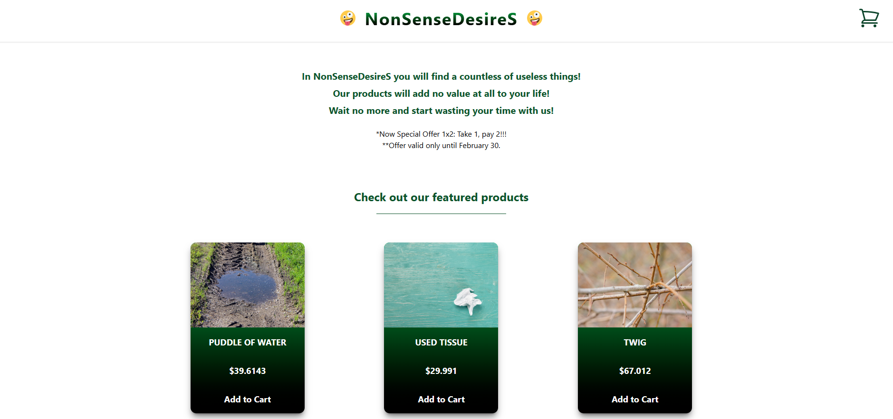

# 🛒 NonSenseDesireS

A responsive landing page with a minimalist design and a humorous take on online shopping.  
> 🖥️📱 This project is compatible with both desktop and mobile/touch devices.

---

## 🎯 Description

This project was built **from scratch** as part of my personal learning journey in software development.  
It helped me strengthen my skills in:

- React
- Tailwind CSS
- JavaScript (ES6+)
- Component-based UI design

**NonSenseDesireS** is a parody e-commerce landing page that showcases ridiculous products nobody needs — but you might still want.

---

## 🧪 Features

- A selection of completely **useless yet oddly tempting products**
- Add items to the **shopping cart**
- Interact with two main actions:
  - **Clear**: Empties the cart
  - **Proceed to Payment**: Triggers a humorous message questioning your life choices

This page is meant for fun and experimentation — no real purchases involved 😉

---

## 💻 Technologies Used

- React
- Tailwind CSS
- JavaScript (Vanilla + JSX)
- Vite

---

## ⚠️ Requirements

- Fully responsive — works on both **desktop and mobile** browsers
- Best experienced in **Chrome** or **Firefox**

---

## 👨‍💻 Author

Developed by **Jose Angel Gil**  
GitHub: [@joseangelgil](https://github.com/joseangelgil)

---

## 📷 Screenshot

